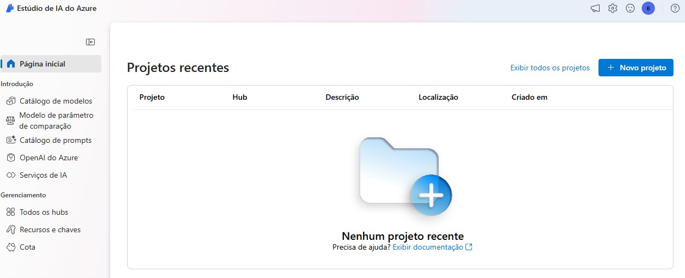

## Criando meu próprio repositório e aumentando ainda mais meu portfólio de projetos no GitHub.

Iniciei minha jornada para por em prática o que aprendi no curso Copilot IA, explorando os recursos do ** Estúdio de IA do Azure**, para aprender a criar um aplicativo de IA generalizada.

Antes de dar-mos início ao projeto, deve ser criado um hub da IA do Azure na conta gratuíta ou paga no Microsoft Azure.

No Microsoft Azure, pesquise por **Estúdio de IA do Azure**, depois **+ Novo hub de AI do Azure**, siga as intruções.

